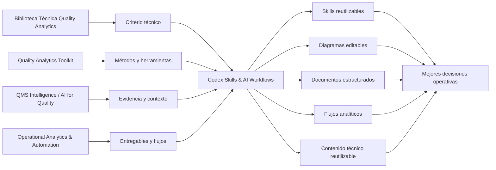
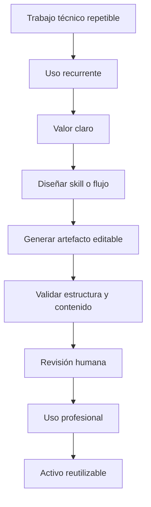

# Codex Skills & AI Workflows

Skills de Codex, flujos asistidos por IA y activos reutilizables para convertir criterio técnico en artefactos editables, documentados y reutilizables.

Este repositorio es la línea de **Quality Analytics** enfocada en organizar capacidades de trabajo asistido por IA para calidad, excelencia operacional, analítica, comunicación técnica y automatización.

El foco no es acumular pruebas sueltas. El foco es construir una capa de infraestructura profesional que ayude a producir diagramas, documentos, análisis, plantillas y flujos con más consistencia, trazabilidad y revisión humana.

---

## Rol dentro del ecosistema



La biblioteca organiza el conocimiento. Los repos principales convierten ese conocimiento en herramientas, evidencia y entregables. Esta línea crea skills y flujos reutilizables para acelerar ese trabajo sin perder criterio técnico.

---

## Qué problemas atiende

| Si necesito... | Enfoque relacionado | Resultado esperado |
|---|---|---|
| Convertir una descripción técnica en un diagrama editable | skills para draw.io / diagrams.net | Diagramas versionables, modificables y reutilizables |
| Crear documentos técnicos consistentes | plantillas LaTeX y generadores | Artículos, newsletters, guías, manuales o libros con estructura editorial |
| Reutilizar herramientas de calidad en flujos asistidos por IA | quality tools skills modulares | Apoyo estructurado para SPC, MSA, capacidad de proceso, FMEA, planes de control, causa raíz, CAPA, Pareto, AQL y DOE |
| Acelerar análisis operativo y validación de datos | analytics skills | Flujos más consistentes para revisar datos, KPIs, supuestos y hallazgos |
| Mejorar contenido técnico sin producir ruido | quality content skills | Ideas, artículos, newsletters y derivados más alineados con Quality Analytics |
| Aplicar IA sin perder control técnico | validación, revisión humana y límites de uso | Salidas útiles sin delegar la responsabilidad profesional |

---

## Repositorios incluidos

| Área | Repositorio | Uso principal |
|---|---|---|
| Diagramas técnicos editables | [drawingskills](https://github.com/fjgonzalezmgt/drawingskills) | Crear diagramas draw.io/diagrams.net desde Codex para Lean Six Sigma, calidad, arquitectura, analítica, BI, lakehouse y MLOps |
| Producción documental técnica | [writingskills](https://github.com/fjgonzalezmgt/writingskills) | Crear artículos, newsletters, guías, manuales y libros a partir de plantillas LaTeX de Quality Analytics |
| Herramientas de calidad | `codex-quality-tools-skills` | En desarrollo: repositorio organizador de skills aplicadas para herramientas de calidad industrial, estructurado en módulos independientes para evitar una skill demasiado amplia |
| Analítica aplicada | `codex-analytics-skills` | En desarrollo: skills para análisis de datos, KPIs, validación de consistencia, interpretación de resultados y documentación de pipelines |
| Power BI y BI aplicado | `codex-powerbi-skills` | En evaluación: skills para medidas DAX, diseño de KPIs, revisión de dashboards y modelos semánticos |
| Investigación y síntesis técnica | `codex-research-skills` | En evaluación: skills para revisar fuentes, comparar marcos técnicos, estructurar artículos y sintetizar evidencia |
| Contenido técnico reutilizable | `codex-quality-content-skills` | En evaluación: skills para convertir guías, artículos y experiencias en posts, newsletters, carruseles, checklists y frameworks |

---

## Línea modular de herramientas de calidad

`codex-quality-tools-skills` no se plantea como una sola skill grande.

La intención es usarlo como repositorio organizador para una familia de skills más pequeñas, cada una con un alcance claro, criterios de uso, límites técnicos y salidas revisables.

| Módulo | Propósito |
|---|---|
| `spc-process-control-skill` | Apoyar análisis de estabilidad, selección de cartas de control, interpretación de señales y planes de reacción operativa. |
| `msa-measurement-systems-skill` | Estructurar estudios de sistemas de medición por variables, atributos, sesgo, linealidad, estabilidad y acuerdo. |
| `process-capability-skill` | Apoyar interpretación de Cp, Cpk, Pp, Ppk, desempeño frente a especificación y riesgos de conclusión. |
| `root-cause-capa-skill` | Estructurar investigación de causa raíz, contención, acciones correctivas, preventivas y verificación de efectividad. |
| `fmea-control-plan-skill` | Conectar modos de falla, riesgos, controles preventivos, controles de detección y planes de control. |
| `pareto-aql-inspection-skill` | Priorizar defectos, reclamos o hallazgos usando Pareto, AQL, muestreo e interpretación de inspección. |
| `doe-industrial-experiments-skill` | Estructurar experimentos industriales con factores, niveles, respuesta, supuestos, análisis y validación. |

La prioridad inicial es desarrollar los módulos que tienen mayor conexión con activos técnicos ya existentes y con decisiones frecuentes en calidad industrial:

1. SPC.
2. MSA.
3. Causa raíz / CAPA.

Después pueden integrarse capacidad de proceso, FMEA con planes de control, Pareto con AQL y DOE.

El criterio no es cubrir todas las herramientas al mismo tiempo. El criterio es construir skills que ayuden a interpretar datos, reconocer límites, documentar razonamiento y mejorar decisiones operativas.

---

## Estado de la línea

| Repo | Estado | Criterio de avance |
|---|---|---|
| [drawingskills](https://github.com/fjgonzalezmgt/drawingskills) | Activo | Ya contiene skills, scripts, ejemplos y referencias para generar diagramas editables. |
| [writingskills](https://github.com/fjgonzalezmgt/writingskills) | Activo | Ya contiene skill, instalador, generador LaTeX y plantillas editoriales. |
| `codex-quality-tools-skills` | Próxima prioridad | Debe avanzar como repositorio organizador de módulos pequeños para herramientas de calidad, no como una sola skill generalista. |
| `codex-analytics-skills` | Próxima prioridad | Refuerza la línea de analítica aplicada y soporte a decisiones operativas. |
| `codex-powerbi-skills` | En evaluación | Útil si se conecta con dashboards, KPIs y modelos semánticos usados de forma recurrente. |
| `codex-research-skills` | En evaluación | Útil para sostener guías, artículos técnicos y síntesis de conocimiento aplicado. |
| `codex-quality-content-skills` | En evaluación | Útil si acelera el sistema editorial de Quality Analytics sin generar ruido. |

Esta línea avanza de forma gradual. Primero consolido casos de uso claros, después los convierto en skills estables y finalmente los separo en repos propios cuando ya tienen uso repetido y valor claro.

---

## Flujo conceptual



Una skill solo tiene sentido cuando convierte un trabajo repetible en una capacidad más clara, auditable y reutilizable.

---

## Casos de uso típicos

### Diagramación técnica

- Crear SIPOC, VSM, DMAIC, PDCA, A3, Ishikawa/fishbone y swimlanes.
- Crear diagramas de arquitectura, infraestructura, cloud, Kubernetes, BI, lakehouse y MLOps.
- Generar bibliotecas reutilizables de shapes para draw.io.
- Mantener archivos editables y versionables, no capturas estáticas.

### Producción documental

- Crear artículos y newsletters técnicos.
- Crear guías, manuales, libros o cursos en LaTeX.
- Mantener plantillas editoriales reutilizables.
- Separar contenido, estructura, metadatos y formato.

### Herramientas de calidad

- Revisar estabilidad de procesos mediante SPC y definir señales que requieren reacción.
- Evaluar sistemas de medición antes de interpretar variación de producto o proceso.
- Interpretar capacidad de proceso sin separar el índice de su contexto operativo.
- Estructurar causa raíz, CAPA y verificación de efectividad con evidencia trazable.
- Conectar FMEA, controles actuales y planes de control con riesgos reales del proceso.
- Usar Pareto, AQL e inspección para priorizar decisiones, no solo para producir reportes.
- Diseñar experimentos industriales cuando exista una pregunta técnica clara y datos confiables.

### Próximos frentes útiles

- Validación, análisis e interpretación de datos operativos.
- Revisión de dashboards, KPIs y modelos de Power BI.
- Síntesis técnica para guías, artículos y marcos de decisión.
- Reutilización de contenido técnico para Quality Analytics.

---

## Criterios para activar un nuevo repo de skills

Antes de separar un frente de trabajo en un repo propio, valido estas preguntas:

1. ¿Lo voy a usar repetidamente?
2. ¿Genera un activo reutilizable?
3. ¿Refuerza mi posicionamiento técnico?
4. ¿Se conecta con Quality Analytics?
5. ¿Reduce trabajo manual, fricción o carga cognitiva?
6. ¿Requiere criterio profesional para validar la salida?
7. ¿Tiene suficiente valor para existir como repo separado?

Si la respuesta no es clara, lo mantengo como experimento o módulo interno antes de convertirlo en repo independiente.

---

## Principios de diseño

- Producir artefactos editables, versionables y auditables siempre que sea posible.
- Separar contenido, configuración, plantillas y lógica.
- Mantener revisión humana antes del uso profesional.
- Documentar límites de uso y riesgos de mala aplicación.
- Evitar automatización sin criterio técnico.
- Convertir flujos repetibles en capacidades reutilizables.
- Priorizar salidas que ayuden a comunicar, analizar, documentar o decidir mejor.

---

## Qué no busca hacer

Este repositorio no busca:

- reemplazar los proyectos principales del portfolio;
- convertir cada experimento en un repo independiente;
- usar IA como autoridad técnica final;
- producir entregables sin revisión humana;
- acumular skills sin casos de uso claros;
- crear repos solo porque el tema suena relacionado;
- automatizar trabajo que todavía no está bien entendido.

La IA puede reducir fricción, pero la responsabilidad profesional permanece en la persona que valida y usa el resultado.

---

## Relación con Quality Analytics

Esta línea complementa el posicionamiento de Quality Analytics:

```text
Calidad + OPEX + Data Analytics + IA aplicada
```

Su función es convertir conocimiento técnico en capacidades operativas reutilizables.

La aplicación principal está en:

- mejora continua;
- herramientas de calidad;
- analítica aplicada;
- comunicación técnica;
- automatización de reportes;
- visualización de procesos;
- soporte a decisiones operativas.

---

## Parte del ecosistema Quality Analytics

- [Biblioteca Técnica Quality Analytics](https://github.com/fjgonzalezmgt/fjgonzalezmgt/blob/main/TECHNICAL_LIBRARY.md)
- [Quality Analytics Toolkit](https://github.com/fjgonzalezmgt/Quality-Analytics-Toolkit)
- [QMS Intelligence / AI for Quality](https://github.com/fjgonzalezmgt/QMS-Intelligence-AI-for-Quality)
- [Operational Analytics & Automation](https://github.com/fjgonzalezmgt/Operational-Analytics-Automation)
- [Learning / Data Science Portfolio](https://github.com/fjgonzalezmgt/Learning-Data-Science-Portfolio)
