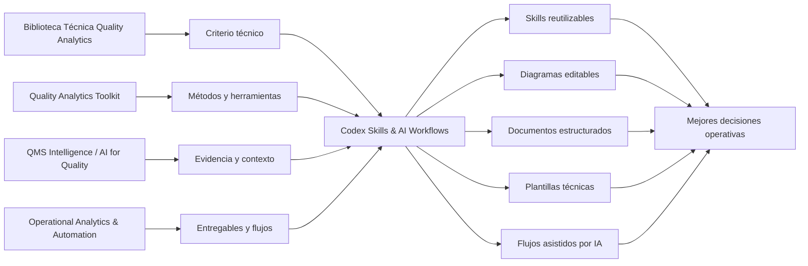
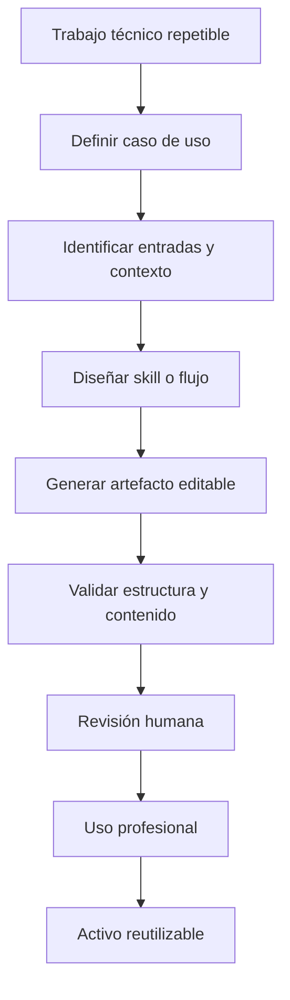

# Codex Skills & AI Workflows

Skills de Codex, flujos asistidos por IA y activos reutilizables para convertir criterio técnico en artefactos editables, documentados y reutilizables.

Este repositorio es la línea de **Quality Analytics** enfocada en organizar capacidades de trabajo asistido por IA para calidad, excelencia operacional, analítica, documentación técnica y automatización.

El foco no es acumular pruebas sueltas. El foco es construir una capa de infraestructura profesional que ayude a producir diagramas, documentos, plantillas, flujos y skills con más consistencia, trazabilidad y revisión humana.

---

## Rol dentro del ecosistema



La biblioteca organiza el conocimiento. Los repos principales convierten ese conocimiento en herramientas, evidencia y entregables. Esta línea crea skills y flujos reutilizables para acelerar ese trabajo sin perder criterio técnico.

---

## Qué problemas atiende

| Si necesitas... | Enfoque relacionado | Resultado esperado |
|---|---|---|
| Convertir una descripción técnica en un diagrama editable | skills para draw.io / diagrams.net | Diagramas versionables, modificables y reutilizables |
| Crear documentos técnicos consistentes | plantillas LaTeX y generadores | Artículos, newsletters, guías, manuales o libros con estructura editorial |
| Reducir fricción en trabajo repetitivo con IA | skills de Codex | Flujos más estandarizados y menos dependientes de pasos manuales |
| Separar contenido, formato y lógica | plantillas, scripts y referencias | Menos retrabajo y más control sobre el entregable |
| Documentar capacidades reutilizables | repos de skills | Conocimiento técnico convertido en infraestructura de trabajo |
| Aplicar IA sin perder control técnico | validación, revisión humana y límites de uso | Salidas útiles sin delegar la responsabilidad profesional |

---

## Repositorios incluidos

| Área | Repositorio | Uso principal |
|---|---|---|
| Diagramas técnicos editables | [drawingskills](https://github.com/fjgonzalezmgt/drawingskills) | Crear diagramas draw.io/diagrams.net desde Codex para Lean Six Sigma, calidad, arquitectura, analítica, BI, lakehouse y MLOps |
| Producción documental técnica | [writingskills](https://github.com/fjgonzalezmgt/writingskills) | Crear artículos, newsletters, guías, manuales y libros a partir de plantillas LaTeX de Quality Analytics |
| QMS y documentación de calidad | `codex-qms-skills` | En desarrollo: skills para QMS, CAPA, auditorías, evidencia y documentación técnica |
| Herramientas de calidad | `codex-quality-tools-skills` | En desarrollo: skills para SPC, MSA, FMEA, DOE, causa raíz, Pareto, AQL y planes de control |
| Analítica aplicada | `codex-analytics-skills` | En desarrollo: skills para análisis de datos, KPIs, validación de consistencia y documentación de pipelines |
| Documentación operativa | `codex-documentation-skills` | En desarrollo: skills para SOPs, checklists, formatos técnicos, reportes y materiales de formación |

---

## Estado de la línea

| Repo | Estado | Criterio de avance |
|---|---|---|
| [drawingskills](https://github.com/fjgonzalezmgt/drawingskills) | Activo | Ya contiene skills, scripts, ejemplos y referencias para generar diagramas editables. |
| [writingskills](https://github.com/fjgonzalezmgt/writingskills) | Activo | Ya contiene skill, instalador, generador LaTeX y plantillas editoriales. |
| `codex-qms-skills` | En desarrollo | Se activará como repo propio cuando existan casos de uso, ejemplos y criterios de validación suficientes. |
| `codex-quality-tools-skills` | En desarrollo | Se activará cuando los flujos para herramientas de calidad estén suficientemente estructurados. |
| `codex-analytics-skills` | En desarrollo | Se activará cuando existan flujos reutilizables para análisis, validación y documentación de datos. |
| `codex-documentation-skills` | En desarrollo | Se activará cuando los flujos documentales operativos estén separados de la producción editorial en LaTeX. |

Esta línea avanza de forma gradual. Primero consolido casos de uso claros, después los convierto en skills estables y finalmente los separo en repos propios cuando tienen estructura, ejemplos y criterios de validación.

---

## Flujo conceptual



Una skill solo tiene sentido cuando convierte un trabajo repetible en una capacidad más clara, auditable y reutilizable.

---

## Casos de uso típicos

### Diagramación técnica

- Crear SIPOC, VSM, DMAIC, PDCA, A3, Ishikawa/fishbone y swimlanes.
- Crear diagramas de arquitectura, infraestructura, cloud, Kubernetes, BI, lakehouse y MLOps.
- Generar bibliotecas reutilizables de shapes para draw.io.
- Mantener archivos editables y versionables, no capturas estáticas.

### Producción documental

- Crear artículos y newsletters técnicos.
- Crear guías, manuales, libros o cursos en LaTeX.
- Mantener plantillas editoriales reutilizables.
- Separar contenido, estructura, metadatos y formato.

### Skills en desarrollo

- Asistencia a QMS, CAPA, auditorías y documentación técnica.
- Soporte a herramientas de calidad como SPC, MSA, FMEA, DOE y causa raíz.
- Validación y documentación de análisis de datos.
- Creación de SOPs, checklists, reportes y formatos técnicos.

---

## Criterios para activar un nuevo repo de skills

Antes de separar un frente de trabajo en un repo propio, valido estas preguntas:

1. Qué trabajo técnico acelera?
2. Qué artefacto produce?
3. Qué criterio profesional requiere validación humana?
4. Qué datos, entradas o contexto necesita?
5. Qué riesgos existen si se usa mal?
6. Cómo se valida la salida?
7. Puede reutilizarse en más de un proyecto?

Si la respuesta no es clara, lo mantengo como experimento o módulo interno antes de convertirlo en repo independiente.

---

## Estándar mínimo de cada skill repo

Cada repositorio de skills debe incluir:

```text
README.md
skills/
examples/
references/
scripts/
tests/ or validation/
```

Y documentar:

- propósito;
- alcance;
- instalación;
- prompts de uso;
- ejemplos;
- criterios de validación;
- límites conocidos;
- riesgos de uso;
- oportunidades futuras.

---

## Principios de diseño

- Producir artefactos editables, versionables y auditables siempre que sea posible.
- Separar contenido, configuración, plantillas y lógica.
- Mantener revisión humana antes del uso profesional.
- Documentar límites de uso y riesgos de mala aplicación.
- Evitar automatización sin criterio técnico.
- Convertir flujos repetibles en capacidades reutilizables.
- Priorizar salidas que ayuden a comunicar, analizar, documentar o decidir mejor.

---

## Qué no busca hacer

Este repositorio no busca:

- reemplazar los proyectos principales del portfolio;
- convertir cada experimento en un repo independiente;
- usar IA como autoridad técnica final;
- producir entregables sin revisión humana;
- acumular skills sin casos de uso claros;
- automatizar trabajo que todavía no está bien entendido.

La IA puede reducir fricción, pero la responsabilidad profesional permanece en la persona que valida y usa el resultado.

---

## Relación con Quality Analytics

Esta línea complementa el posicionamiento de Quality Analytics:

```text
Calidad + OPEX + Data Analytics + IA aplicada
```

Su función es convertir conocimiento técnico en capacidades operativas reutilizables.

La aplicación principal está en:

- sistemas de gestión de calidad;
- mejora continua;
- analítica aplicada;
- documentación técnica;
- automatización de reportes;
- visualización de procesos;
- soporte a decisiones operativas.

---

## Parte del ecosistema Quality Analytics

- [Biblioteca Técnica Quality Analytics](https://github.com/fjgonzalezmgt/fjgonzalezmgt/blob/main/TECHNICAL_LIBRARY.md)
- [Quality Analytics Toolkit](https://github.com/fjgonzalezmgt/Quality-Analytics-Toolkit)
- [QMS Intelligence / AI for Quality](https://github.com/fjgonzalezmgt/QMS-Intelligence-AI-for-Quality)
- [Operational Analytics & Automation](https://github.com/fjgonzalezmgt/Operational-Analytics-Automation)
- [Learning / Data Science Portfolio](https://github.com/fjgonzalezmgt/Learning-Data-Science-Portfolio)
